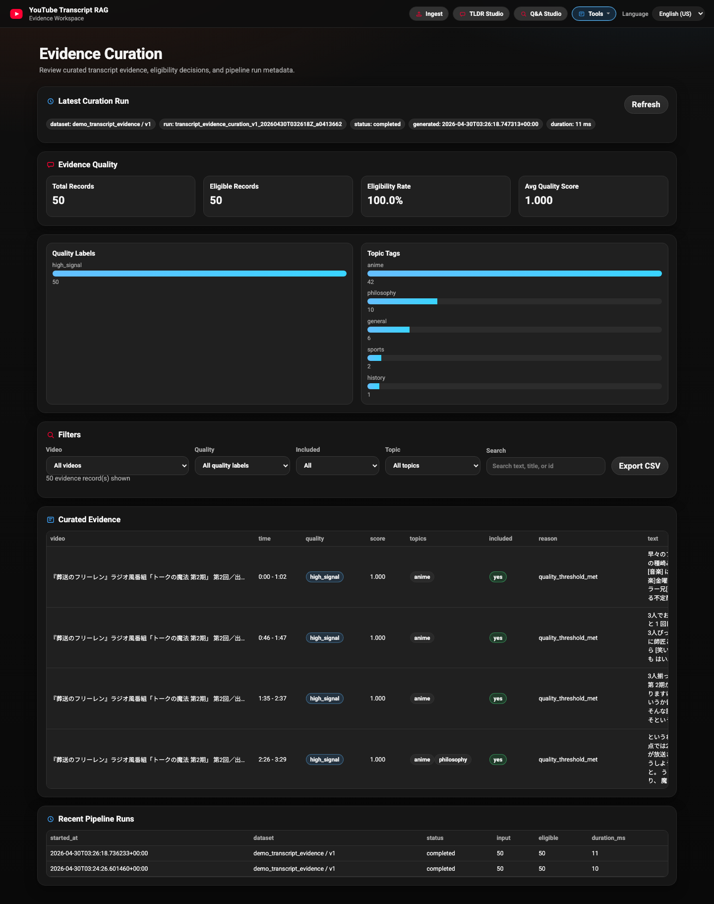

# YouTube Transcript Retrieval Evaluation Workbench

Local-first retrieval and evaluation workbench for English and Japanese YouTube transcripts.

This project started as transcript search/RAG and evolved into a retrieval-quality workbench. It supports transcript ingestion, timestamped multilingual chunking, local FAISS indexing, dense / lexical / hybrid retrieval, local result labeling, ranking metrics, run comparison, citation-backed Q&A, and optional OCR evidence search for local or permissioned video files.

## Quick Start

From the repository root:

```bash
pip install -r requirements.txt
cp .env.example .env.local
python local_preview/local_api.py
```

Set your local API keys in `.env.local` before starting the app:

```env
OPENAI_API_KEY=your_openai_api_key_here
ANTHROPIC_API_KEY=your_anthropic_api_key_here
```

Notes:
- `.env` and `.env.local` are gitignored for local-only secrets.
- `.env.example` is the checked-in template for portfolio setup.
- `local_preview/local_api.py` loads `.env` first, then `.env.local`, so `.env.local` wins for machine-specific overrides.
- For a private local key file, run `chmod 600 .env.local` after you create it.

Open:

- `http://127.0.0.1:8000/` (Main Console)
- `http://127.0.0.1:8000/reviews.html` (Reviewed Chunks)
- `http://127.0.0.1:8000/evidence.html` (Evidence Curation)
- `http://127.0.0.1:8000/evaluation.html` (Evaluation Workspace)
- `http://127.0.0.1:8000/chunking.html` (Chunking Lab)

Note:
- If model download/network is unavailable, the app falls back to local hashing embeddings in local preview mode.
- For fully offline local-preview startup, run `YT_RAG_FORCE_HASH_EMBEDDINGS=1 python local_preview/local_api.py`.

## Portfolio Summary

Built a local-first retrieval evaluation workbench for English/Japanese YouTube transcripts. The system supports transcript ingestion, multilingual chunking, FAISS search, hybrid retrieval, local labeling, ranking metrics, run comparison, citation-backed Q&A, and OCR evidence search for local video files.

## What This Project Solves

Most RAG demos stop after retrieving chunks and sending them to an LLM. This project focuses on whether retrieval is actually good: it gives you a local workflow for labeling retrieved results, running repeatable evaluations, tracking ranking metrics, and comparing retrieval runs before using the evidence in downstream answers.

The Q&A and OCR features are extensions on top of that retrieval layer. Citation-backed Q&A shows how retrieved transcript evidence can support answers, while local-video OCR adds another evidence source for visible text in files you own or have permission to process.

## System Flow

1. Ingest YouTube transcript
2. Normalize and chunk transcript with timestamp metadata
3. Generate embeddings and build local FAISS index
4. Retrieve chunks using dense, lexical, or hybrid search
5. Label retrieved results in the Evaluation workspace
6. Compare retrieval runs using ranking metrics
7. Generate grounded answers from retrieved evidence
8. Optionally merge transcript evidence with OCR evidence from local video frames

## Language Support

- Current support is **English (EN-US)** and **Japanese (JP)** only.
- The UI includes a **Language** selector to switch between **EN** and **JP**.

## What's New

- **v2 Local Eval Release:** added the Evaluation workspace with query set management, run snapshots, local labels, core ranking metrics, and run-to-run comparison.
- **Theme TLDR + Timestamp Quality Update:** moved TLDR generation onto persisted full transcripts with per-video caching, improved theme ranking and timestamp mapping, strengthened theme summaries/context, and improved ingest-side video management.
- **March 7, 2026:** added TLDR fallback retry metadata, aligned cross-page header navigation, simplified the ingest hero, and expanded regression coverage for fallback and navigation behavior.
- **March 13, 2026:** added the Chunking Lab for chunking strategy comparison, including preview/search comparison routes, evaluation export, persisted transcript requirements, and chunking-related regression coverage.
- **April 1, 2026:** added citation-backed Q&A polish, restored EN/JP support in the new answer UI, added a targeted frontend CI gate, and added an assisted labeling workflow for batching live `/v1/search` results and POSTing approved labels back into search feedback.
- **May 7, 2026:** streamlined local preview navigation, made YouTube ingest the primary first-run flow, moved local OCR behind an advanced disclosure, added ingested-video thumbnails, improved backend error copy, and combined Q&A Search/Ask into a tabbed workbench.

## OCR Evidence Search for Local Videos

This extension handles local video files that you own or have permission to process. It extracts timestamped frames, runs Japanese/English OCR over visible text, embeds the OCR text with the existing embedding approach, and lets you search OCR evidence alongside transcript evidence.

Legal/platform note: public YouTube videos continue to use transcript, metadata, and timestamp-link workflows. Full frame extraction and OCR processing is for local or permissioned video files only. This project does not add public YouTube video downloading, YouTube page scraping, or blocking bypass logic for OCR.

Setup requirements:

- `ffmpeg` and `ffprobe` available on `PATH`
- Python dependencies from `pip install -r requirements.txt` (includes EasyOCR)
- Local video containers accepted by the local API: `.mp4`, `.m4v`, `.mov`, `.mkv`, `.webm`

Local UI flow:

1. Start the local preview: `python local_preview/local_api.py`
2. Open `http://127.0.0.1:8000/index.html`.
3. In Ingest Gateway, use **Local Video (Advanced)** with a local file path and a stable `video_id`.
4. In Q&A Studio, choose **Ask** or **Search**, then set Evidence to **Transcript + OCR** or **OCR only** as needed.

The local API routes are:

- `POST /v1/local-video-ocr/jobs`
- `GET /v1/local-video-ocr/jobs`
- `GET /v1/local-video-ocr/jobs/{job_id}`
- `GET /v1/local-video-ocr/videos/{video_id}`
- `POST /v1/search-multimodal`
- `POST /v1/ask-multimodal`

Example local-video flow:

```bash
python pipelines/extract_frames.py \
  --video-id demo_001 \
  --video-path data/raw/demo_001.mp4 \
  --interval-sec 10

python pipelines/run_ocr.py --video-id demo_001
python pipelines/embed_ocr.py --video-id demo_001

python retrieval/search_multimodal.py \
  --query "what does the slide say about inflation?" \
  --video-id demo_001 \
  --top-k 5
```

Frame metadata is written to `data/processed/{video_id}/frames.jsonl`:

```json
{"video_id":"demo_001","frame_id":"frame_000010","timestamp_sec":10,"timestamp_hhmmss":"00:00:10","frame_path":"data/frames/demo_001/frame_000010.jpg","extraction_method":"ffmpeg","created_at":"..."}
```

OCR metadata is written to `data/processed/{video_id}/frame_ocr.jsonl`:

```json
{"video_id":"demo_001","frame_id":"frame_000010","timestamp_sec":10,"timestamp_hhmmss":"00:00:10","frame_path":"data/frames/demo_001/frame_000010.jpg","ocr_text":"Inflation expectations","ocr_confidence":0.91,"ocr_engine":"easyocr","created_at":"..."}
```

OCR vectors are stored separately from transcript vectors at `data/index/ocr/{video_id}.faiss` with metadata in `data/index/ocr/{video_id}.jsonl`. Merged search evidence uses `source_type` (`transcript` or `ocr`), `video_id`, timestamp fields, `text`, `score`, and `metadata`.

## Evidence Curation Workflow

`pipelines/curate_evidence.py` turns already-ingested transcript chunks into a curated local evidence dataset. Version 1A is deterministic and local-first: it reuses the stored transcript library, adds heuristic quality signals and topic tags, marks retrieval eligibility, and records reproducible pipeline run metadata without calling OpenAI, Anthropic, or any external service.

Example:

```bash
python pipelines/curate_evidence.py \
  --dataset-id demo_transcript_evidence \
  --dataset-version v1 \
  --language ja \
  --limit 200
```

Outputs are written under `data/runtime/`:

- `pipeline_runs.jsonl` - append-only run metadata with dataset/version, filters, counts, status, duration, and config.
- `model_inference_results.jsonl` - append-only heuristic scoring results using `heuristic_quality_scorer` `v1`.
- `curated_evidence_manifest.jsonl` - current curated transcript evidence rows with full text, quality labels, topic tags, and inclusion/exclusion decisions.
- `evidence_quality_report.json` - summary quality report with eligibility rate, label counts, topic counts, score range, and timestamp/text validation counts.

Open `http://127.0.0.1:8000/evidence.html` to inspect the generated artifacts in the local review UI. The Evidence workspace is read-only in Version 1A; generate or refresh artifacts with the CLI command above.

This is a local data curation workflow for retrieval evidence: quality signals are represented as inference records, curation decisions are captured in the manifest, each run is traceable by `pipeline_run_id`, retrieval eligibility is explicit, and the quality report checks evidence/data readiness before downstream search or answer generation.

## Run In 60 Seconds

From the repository root:

```bash
pip install -r requirements.txt
cp .env.example .env.local
python local_preview/local_api.py
```

Open:

- `http://127.0.0.1:8000/`
- `http://127.0.0.1:8000/reviews.html`
- `http://127.0.0.1:8000/evidence.html`
- `http://127.0.0.1:8000/evaluation.html`
- `http://127.0.0.1:8000/chunking.html`

## Demo Flow (Portfolio-Friendly)

1. Ingest one or more videos/playlists.
2. Ask a question in Q&A Studio and inspect the citation-backed answer and supporting evidence.
3. Switch to Search in `hybrid` mode and inspect ranked chunks.
4. Open Evaluation page and create/import a query set.
5. Execute a full run, label results, and inspect quality metrics.
6. Compare two runs to show regression/lift.
7. Export run bundle JSON for reproducibility.

## Screenshots

### Ingest Gateway


### Evaluation Metrics


### Run Comparison


### Evidence Curation



### Q&A Studio (JP)


## Architecture

```text
Browser UI (index / reviews / evidence / evaluation / chunking)
          |
          v
local_preview/local_api.py  (local HTTP API + static files)
          |
          v
multilingual/*  (retrieval pipeline: chunking, embeddings, hybrid search)
          |
          v
local files:
  - data/library/ (library manifest + per-video records)
  - data/index/ (FAISS index artifacts)
  - data/index/ocr/ (local-video OCR FAISS indexes)
  - data/frames/ and data/processed/ (local-video OCR outputs)
  - data/runtime/ (feedback, ask history, ingest logs, evidence curation artifacts)
  - data/cache/summaries/ (per-video TLDR cache files)
  - browser localStorage (evaluation query sets/runs/labels)
```

## Project Structure

- `local_preview/` - local web UI + API for development and demos
- `multilingual/` - retrieval engine, multilingual tokenization, transcript processing
- `pipelines/` - local, permissioned video frame/OCR/embedding scripts and evidence curation
- `production_cloudflare/` - Cloudflare deployment stack (separate from local preview)
- `retrieval/` - OCR and multimodal evidence search helpers
- `tests/` - unit/integration tests for core behavior

## Known Limitations

- Evaluation mode is currently **single-reviewer**.
- Evaluation labels are **browser-local** (not shared across devices by default).
- Inter-rater agreement/adjudication workflow is not implemented yet.
- Retrieval quality depends on transcript availability from YouTube.
- Chunking Lab compares chunking strategies on already ingested videos and needs a stored `full_transcript`; legacy videos without that artifact must be re-ingested before preview/search comparison works.

## Assisted Labeling Workflow

The local preview includes `local_preview/review_agent_workflow.py` for assisted review of search-result labels. It reuses the live `/v1/search` and `/v1/feedback/search-review` endpoints instead of introducing a separate review store.
Use it after manual search or Q&A testing when you want label recommendations while the existing feedback API remains the single source of truth.

Typical flow:

```bash
python local_preview/review_agent_workflow.py build-batch \
  --query-file local_preview/examples/review_queries.example.json \
  --include-existing-feedback

python local_preview/review_agent_workflow.py render-prompt \
  --kind reviewer \
  --input data/runtime/review_batches/<batch>.json \
  --shard-id shard-001

python local_preview/review_agent_workflow.py build-adjudication \
  --input data/runtime/review_recommendations/<recommendations>.json

python local_preview/review_agent_workflow.py apply \
  --input data/runtime/review_recommendations/<approved>.json
```

The checked-in example query file is intentionally Japanese and aligned to the current `葬送のフリーレン` transcript library in local preview. If you are reviewing a different set of videos, copy that file and replace the queries with library-specific prompts before building a batch.

## Tests

```bash
pytest tests/
HF_HUB_OFFLINE=1 pytest multilingual/tests/test_chunking_strategies.py -q
pytest tests/test_chunking_api.py -q
```
