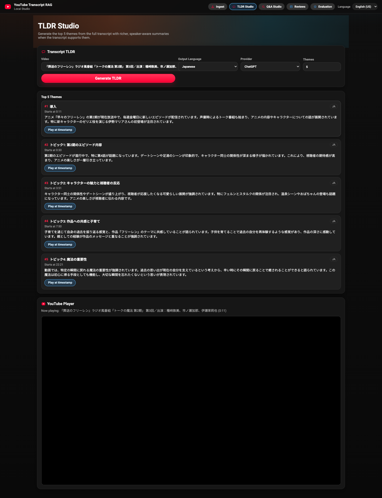
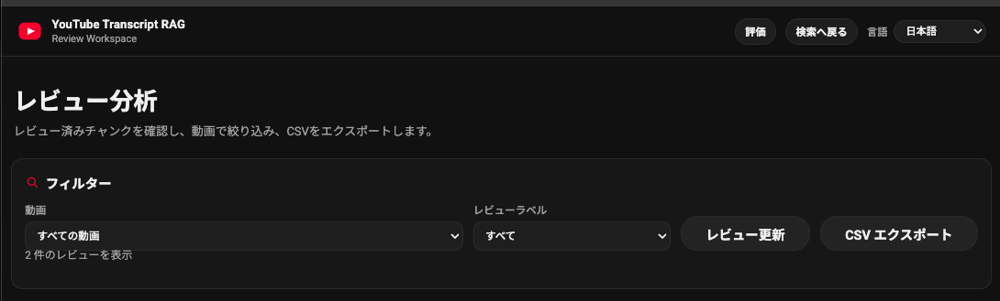
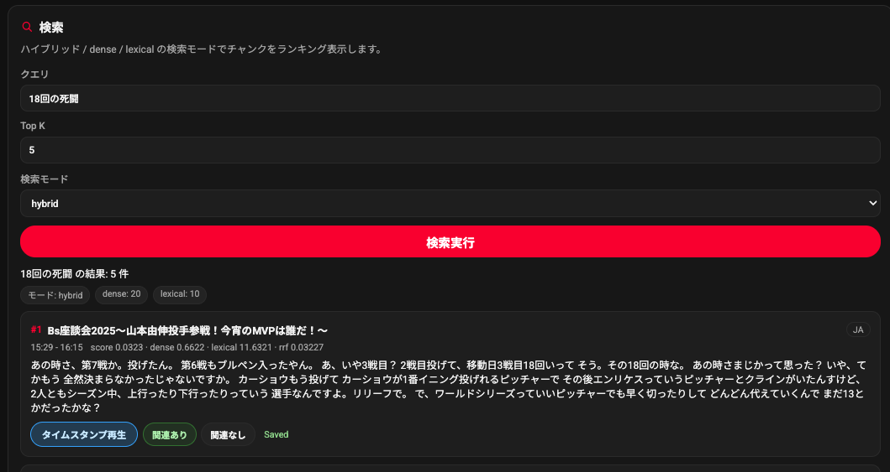
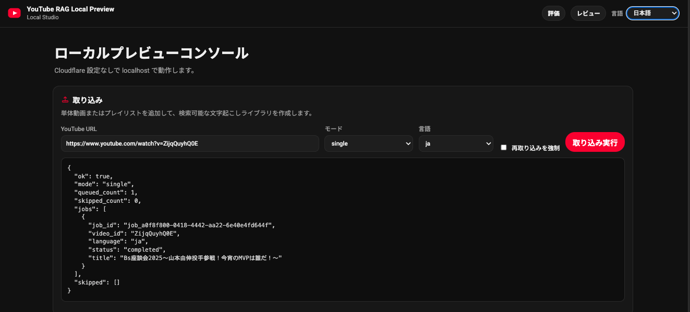

# YouTube Transcript RAG

If you see an `AGENTS.md` file in this repo, it documents AI/agent-assisted development conventions and can be ignored for normal setup, review, and runtime usage.

Local-first YouTube transcript retrieval and evaluation platform.

This project lets you ingest YouTube transcripts, run semantic retrieval (`hybrid` / `dense` / `lexical`), ask grounded questions with citation-backed evidence, and evaluate ranking quality with a dedicated local Evaluation workspace. It currently supports English (EN-US) and Japanese (JP) only, with a built-in UI Language switch for EN/JP.

## Language Support

- Current support is **English (EN-US)** and **Japanese (JP)** only.
- The UI includes a **Language** selector to switch between **EN** and **JP**.

## What's New

- **v2 Local Eval Release:** added the Evaluation workspace with query set management, run snapshots, local labels, core ranking metrics, and run-to-run comparison.
- **Theme TLDR + Timestamp Quality Update:** moved TLDR generation onto persisted full transcripts with per-video caching, improved theme ranking and timestamp mapping, strengthened theme summaries/context, and improved ingest-side video management.
- **March 7, 2026:** added TLDR fallback retry metadata, aligned cross-page header navigation, simplified the ingest hero, and expanded regression coverage for fallback and navigation behavior.
- **March 13, 2026:** added the Chunking Lab with preview/search comparison routes, side-by-side chunking strategy analysis, evaluation export, persisted transcript requirements, and chunking-related regression coverage.
- **April 1, 2026:** added grounded answer mode polish for citation-backed Q&A, restored EN/JP support in the new answer UI, added a targeted frontend CI gate, and added a local agent-review workflow for batching live `/v1/search` results and POSTing approved labels back into search feedback.

## Quick Start

From the repository root:

```bash
pip install -r requirements.txt
cp .env.example .env.local
python local_preview/local_api.py
```

Set your local API keys in `.env.local` before starting the app:

```env
OPENAI_API_KEY=your_openai_api_key_here
ANTHROPIC_API_KEY=your_anthropic_api_key_here
```

Notes:
- `.env` and `.env.local` are gitignored for local-only secrets.
- `.env.example` is the checked-in template for portfolio setup.
- `local_preview/local_api.py` loads `.env` first, then `.env.local`, so `.env.local` wins for machine-specific overrides.
- For a private local key file, run `chmod 600 .env.local` after you create it.

Open:

- `http://127.0.0.1:8000/` (Main Console)
- `http://127.0.0.1:8000/reviews.html` (Reviewed Chunks)
- `http://127.0.0.1:8000/evaluation.html` (Evaluation Workspace)
- `http://127.0.0.1:8000/chunking.html` (Chunking Lab)

Note:
- If model download/network is unavailable, the app falls back to local hashing embeddings in local preview mode.

## Run In 60 Seconds

From the repository root:

```bash
pip install -r requirements.txt
cp .env.example .env.local
python local_preview/local_api.py
```

Open:

- `http://127.0.0.1:8000/`
- `http://127.0.0.1:8000/reviews.html`
- `http://127.0.0.1:8000/evaluation.html`
- `http://127.0.0.1:8000/chunking.html`

## Demo Flow (Portfolio-Friendly)

1. Ingest one or more videos/playlists.
2. Run Search in `hybrid` mode and inspect ranked chunks.
3. Ask a question in Q&A Studio and inspect the grounded answer, citations, and supporting evidence.
4. Open Evaluation page and create/import a query set.
5. Execute a full run, label results, and inspect quality metrics.
6. Compare two runs to show regression/lift.
7. Export run bundle JSON for reproducibility.

## Screenshots

### TLDR Studio



### Evaluation Metrics



### Run Comparison



### UI Language Toggle (EN/JP)



## Architecture

```text
Browser UI (index / reviews / evaluation / chunking)
          |
          v
local_preview/local_api.py  (local HTTP API + static files)
          |
          v
multilingual/*  (retrieval pipeline: chunking, embeddings, hybrid search)
          |
          v
local files:
  - data/library/ (library manifest + per-video records)
  - data/index/ (FAISS index artifacts)
  - data/runtime/ (feedback, ask history, ingest logs)
  - data/cache/summaries/ (per-video TLDR cache files)
  - browser localStorage (evaluation query sets/runs/labels)
```

## Project Structure

- `local_preview/` - local web UI + API for development and demos
- `multilingual/` - retrieval engine, multilingual tokenization, transcript processing
- `production_cloudflare/` - Cloudflare deployment stack (separate from local preview)
- `tests/` - unit/integration tests for core behavior

## Known Limitations

- Evaluation mode is currently **single-reviewer**.
- Evaluation labels are **browser-local** (not shared across devices by default).
- Inter-rater agreement/adjudication workflow is not implemented yet.
- Retrieval quality depends on transcript availability from YouTube.
- Chunking Lab works on already ingested videos and needs a stored `full_transcript`; legacy videos without that artifact must be re-ingested before preview/search comparison works.

## Agent Review Workflow

The local preview now includes `local_preview/review_agent_workflow.py` for agent-assisted review of search-result labels. It reuses the live `/v1/search` and `/v1/feedback/search-review` endpoints instead of introducing a separate review store.
Use it after manual search or Q&A testing when you want reviewer agents to recommend labels while the existing feedback API remains the single source of truth.

Typical flow:

```bash
python local_preview/review_agent_workflow.py build-batch \
  --query-file local_preview/examples/review_queries.example.json \
  --include-existing-feedback

python local_preview/review_agent_workflow.py render-prompt \
  --kind reviewer \
  --input data/runtime/review_batches/<batch>.json \
  --shard-id shard-001

python local_preview/review_agent_workflow.py build-adjudication \
  --input data/runtime/review_recommendations/<recommendations>.json

python local_preview/review_agent_workflow.py apply \
  --input data/runtime/review_recommendations/<approved>.json
```

The checked-in example query file is intentionally Japanese and aligned to the current `葬送のフリーレン` transcript library in local preview. If you are reviewing a different set of videos, copy that file and replace the queries with library-specific prompts before building a batch.

## Tests

```bash
pytest tests/
HF_HUB_OFFLINE=1 pytest multilingual/tests/test_chunking_strategies.py -q
pytest tests/test_chunking_api.py -q
```
